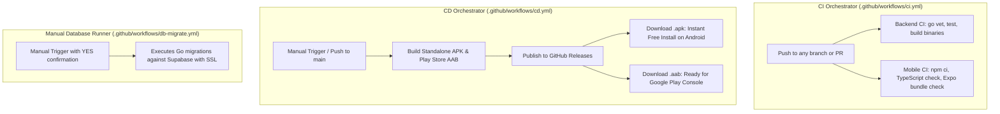

# Time Tracker CI/CD & Release Guide

This guide details how the continuous integration (CI) and continuous delivery (CD) pipelines work for Time Tracker, how to connect your free Supabase PostgreSQL database, and how to distribute the mobile app (free standalone APK or Google Play Store bundle).

---

## 1. Workflow Architecture

---

## 2. Setting Up Your Free Cloud Database (Supabase)

To prepare a free PostgreSQL instance without running servers locally:

1. **Create an account & project:**
   - Go to [supabase.com](https://supabase.com) and sign up (Free).
   - Click **New Project**, choose a project name (e.g. `timetracker-db`), set a strong database password, and select a region near you.

2. **Retrieve Connection Details:**
   - In your Supabase project dashboard, navigate to **Project Settings** > **Database**.
   - Under **Connection parameters**, note the following values:
     - **Host**: e.g., `aws-0-ap-southeast-1.pooler.supabase.com` (or direct host `db.xxxxxxxxxxxx.supabase.co`)
     - **Port**: `5432` (or `6543` for connection pooler)
     - **Database name**: `postgres`
     - **User**: `postgres.your-project-ref` (or `postgres`)
     - **Password**: The password you set during project creation

3. **Add Secrets to GitHub:**
   - In your GitHub repository, go to **Settings** > **Secrets and variables** > **Actions**.
   - Click **New repository secret** and add:
     - `DB_HOST`: Your Supabase database host
     - `DB_PORT`: `5432` (or `6543`)
     - `DB_USER`: Your Supabase database user
     - `DB_PASSWORD`: Your Supabase database password
     - `DB_SCHEMA_NAME`: `postgres`
     - `DB_SSL_MODE`: `require`

---

## 3. Running Database Migrations

The database migration workflow is strictly **manual** to prevent unintended changes to production data.

### To run migrations on demand:
1. Go to your GitHub repository and click the **Actions** tab.
2. Under **Workflows** in the left sidebar, click **Database Migration Runner**.
3. Click **Run workflow**.
4. In the confirmation box, type `YES` and click **Run workflow**.
5. The pipeline will securely connect to Supabase over SSL and execute all migrations in [`backend/migrate/migrate.go`](file:///home/sanjaya/Desktop/my-work/time-tracker/backend/migrate/migrate.go).

---

## 4. Triggering the CD Orchestrator (Option A Release)

The CD Orchestrator allows you to release new versions on demand:

1. Go to the **Actions** tab in GitHub.
2. Select **CD Orchestrator**.
3. Click **Run workflow** and enter:
   - **Release version**: e.g. `1.0.0`
   - **Android Version Code**: e.g. `1` (increment by 1 for each subsequent release)
   - **Release title**: e.g. `Time Tracker v1.0.0`
   - **Release notes**: Brief description of new features / fixes
   - **Run Supabase DB migrations**: Check this if you also want migrations applied before the build
4. Click **Run workflow**.

### What Gets Created:
- **GitHub Release (`v1.0.0`)**: Automatically published with 2 files attached:
  1. `TimeTracker-v1.0.0.apk`: Can be downloaded straight onto any Android phone and installed immediately (100% free, no Google Play account required).
  2. `TimeTracker-v1.0.0.aab`: Production Android App Bundle built for Google Play Store.
- **Workflow Artifacts**: Both `.apk` and `.aab` are also archived under the workflow run summary for 60 days.

---

## 5. Transitioning to Google Play Store in the Future

When you are ready to publish on Google Play:
1. Pay the one-time $25 USD registration fee at [play.google.com/console](https://play.google.com/console).
2. Complete your developer profile and create an app listing for **Time Tracker** with package name `com.sanjayapradeep.timetracker`.
3. Download the `TimeTracker-vX.Y.Z.aab` file from your GitHub Releases.
4. Upload that `.aab` file into **Internal Testing** or **Production** in the Google Play Console UI.
